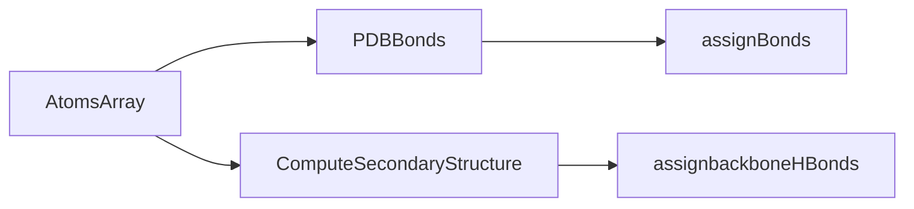

# 3Dmol


#### Functions

* bondTable( ) - contains list of bond length (covalent radii) of all elements of periodic table 

* bondLength( ) - returns the  bond length from table or value 1.6 , i.e  no bond exist as all values     must be less that 1.6.

*  areConnected ( ) - return if there is bond between the two atoms. 

  *Logic* : the distance between two  bonded atoms is less than sum of bond length.

* assignBonds( ) - assign bond between two bonded atoms.

  ###### Flowchart-1

  

  ```mermaid
  graph LR
  assignBonds --> findConnections --> areConnected
  ```

  

* assignPDBBonds() - assign bond for PDB format especially for protiens.

* assignBackboneHBonds() - assigns Hydrogen bonds.(only between Oxygen and Nitrogen)

* computeSecondaryStructure() - compute, per residue, what the secondary structure is.

* validateBonds() - check all bond are clearly labeled and are two way.

* processSymmetries() -adds symmetry info to either duplicate and rotate/translate biological unit later or add extra atoms now.

  ###### Flowchart-2



#### Parsers

* VASP

* CUBE

* XYZ

* parseV2000

* parseV3000

* SDF

* cdjson (ChemDoodle json)

* mcif

* MOL2

* PDB

* PQR

* MMTF

* PRMTOP

* GRO

* LAMMPSTRJ

  ###### Flowchart-3

  ```mermaid
  graph LR
  Parser --> Vasp --> atoms
  Parser --> Cube--> atoms
  Parser --> XYZ --> atoms
  Parser --> parseV2000 --> atoms
  Parser --> parseV3000 --> atoms
  Parser --> SDF --> atoms
  Parser --> cdjson--> atoms
  Parser --> mcif --> atoms
  Parser --> MOL2 --> atoms
  Parser --> PDB --> atoms
  Parser --> PQR --> atoms
  Parser --> MMTF --> atoms
  Parser --> PRMTOP --> atoms
  Parser --> GRO --> atoms
  Parser --> LAMMPSTRJ --> atoms
  
  ```

  


